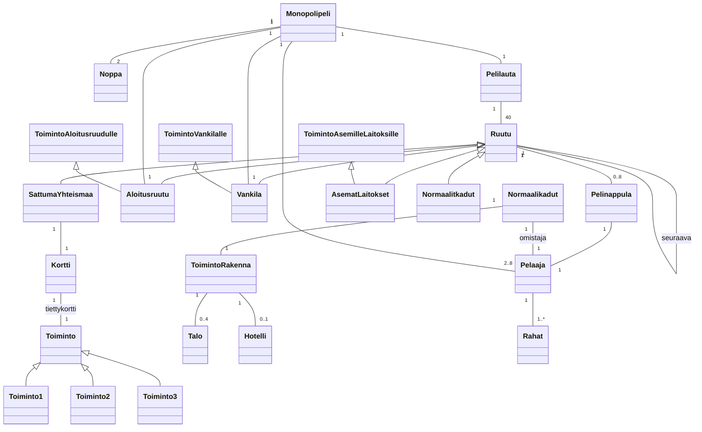

# Tehtävä 1

```mermaid
 classDiagram
    Monopolipeli "1" -- "2" Noppa
    Monopolipeli "1" -- "1" Pelilauta
    Pelilauta "1" -- "40" Ruutu
    Ruutu "1" -- "1" Ruutu : seuraava
    Ruutu "1" -- "0..8" Pelinappula
    Pelinappula "1" -- "1" Pelaaja
    Pelaaja "2..8" -- "1" Monopolipeli
    Ruutu <|-- Aloitusruutu
    Ruutu <|-- Vankila
    Ruutu <|-- SattumaYhteismaa
    Ruutu <|-- AsematLaitokset
    Ruutu <|-- Normaalitkadut
    Monopolipeli "1" -- "1" Aloitusruutu
    Monopolipeli "1" -- "1" Vankila
    ToimintoAloitusruudulle <|-- Aloitusruutu
    ToimintoVankilalle <|-- Vankila
    ToimintoAsemilleLaitoksille <|-- AsematLaitokset
    SattumaYhteismaa "1" -- "1" Kortti
    Kortti "1" -- "1" Toiminto: tiettykortti
    Toiminto <|-- Toiminto1
    Toiminto <|-- Toiminto2
    Toiminto <|-- Toiminto3
    Normaalikadut "1" -- "1" ToimintoRakenna
    ToimintoRakenna "1" -- "0..4" Talo
    ToimintoRakenna "1" -- "0..1" Hotelli
    Pelaaja "1" -- "1..*" Rahat
    Normaalikadut "1" -- "1" Pelaaja: omistaja
```

# Tehtävä 2
