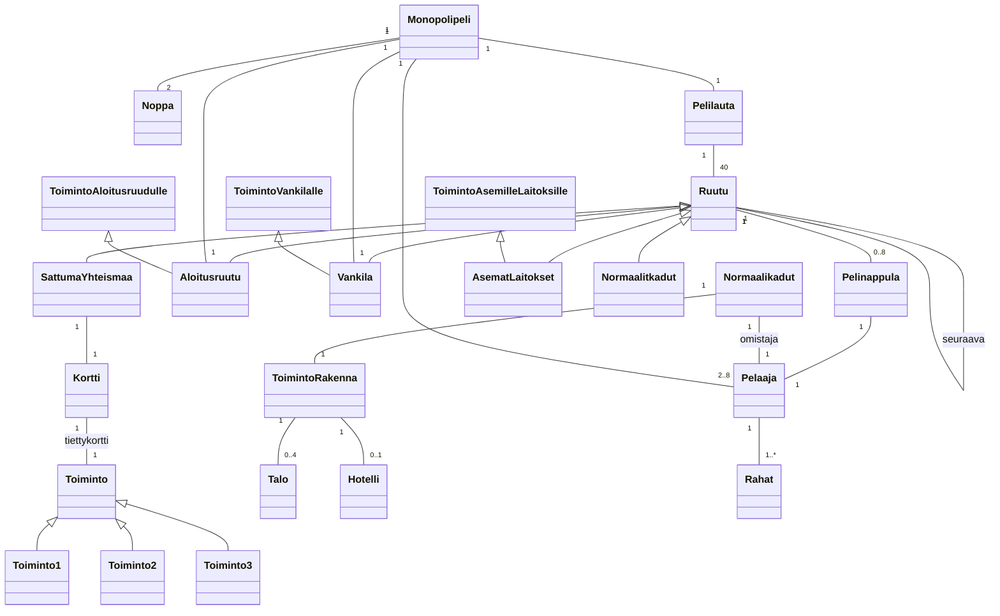
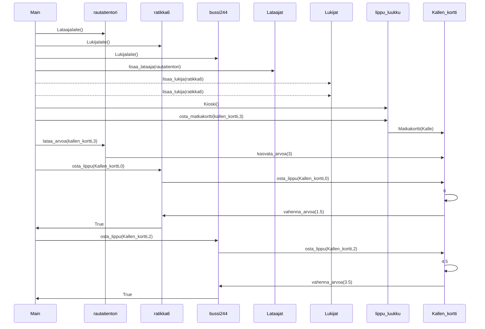

# Tehtävä 1

```mermaid
 classDiagram
    Monopolipeli "1" -- "2" Noppa
    Monopolipeli "1" -- "1" Pelilauta
    Pelilauta "1" -- "40" Ruutu
    Ruutu "1" -- "1" Ruutu : seuraava
    Ruutu "1" -- "0..8" Pelinappula
    Pelinappula "1" -- "1" Pelaaja
    Pelaaja "2..8" -- "1" Monopolipeli
    Ruutu <|-- Aloitusruutu
    Ruutu <|-- Vankila
    Ruutu <|-- SattumaYhteismaa
    Ruutu <|-- AsematLaitokset
    Ruutu <|-- Normaalitkadut
    Monopolipeli "1" -- "1" Aloitusruutu
    Monopolipeli "1" -- "1" Vankila
    ToimintoAloitusruudulle <|-- Aloitusruutu
    ToimintoVankilalle <|-- Vankila
    ToimintoAsemilleLaitoksille <|-- AsematLaitokset
    SattumaYhteismaa "1" -- "1" Kortti
    Kortti "1" -- "1" Toiminto: tiettykortti
    Toiminto <|-- Toiminto1
    Toiminto <|-- Toiminto2
    Toiminto <|-- Toiminto3
    Normaalikadut "1" -- "1" ToimintoRakenna
    ToimintoRakenna "1" -- "0..4" Talo
    ToimintoRakenna "1" -- "0..1" Hotelli
    Pelaaja "1" -- "1..*" Rahat
    Normaalikadut "1" -- "1" Pelaaja: omistaja
```

# Tehtävä 2

```mermaid
sequenceDiagram
  participant Main
  participant rautatientori
  participant ratikka6
  participant bussi244
  participant Lataajat
  participant Lukijat
  Main->>rautatientori: Lataajalaite()
  Main->>ratikka6: Lukijalaite()
  Main->>bussi244: Lukijalaite()
  Main->>Lataajat: lisaa_lataaja(rautatientori)
  Main-->>Lukijat: lisaa_lukija(ratikka6)
  Main-->>Lukijat: lisaa_lukija(ratikka6)
  Main->>lippu_luukku: Kioski()
  Main->>lippu_luukku: osta_matkakortti(kallen_kortti,3)
  lippu_luukku->>Kallen_kortti: Matkakortti(Kalle)
  Main->>rautatientori: lataa_arvoa(kallen_kortti,3)
  rautatientori->>Kallen_kortti: kasvata_arvoa(3)
  Main->>ratikka6: osta_lippu(Kallen_kortti,0)
  ratikka6->>Kallen_kortti: osta_lippu(Kallen_kortti,0)
  Kallen_kortti->>Kallen_kortti: 6
  Kallen_kortti->>ratikka6: vahenna_arvoa(1.5)
  ratikka6->>Main: True
  Main->>bussi244: osta_lippu(Kallen_kortti,2)
  bussi244->>Kallen_kortti: osta_lippu(Kallen_kortti,2)
  Kallen_kortti->>Kallen_kortti: 4.5
  Kallen_kortti->>bussi244: vahenna_arvoa(3.5)
  bussi244->>Main: True
```
